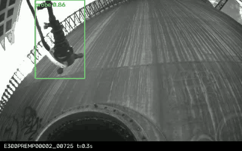

# Probe Detection with Deep Learning

Detection of the ultrasonic thickness measurement probe 

A fine-tuned YOLO11n takes an image and returns the probe bounding box, or
reports that no probe is present. **Results on a leakage-free validation
split** (76 images from 5 flights never seen in training):

| model | precision | recall | F1 | mAP@0.5 | mean IoU | ms/img (CPU) |
|---|---|---|---|---|---|---|
| YOLO11n (delivered) | 0.996 | 0.895 | 0.943 | 0.961 | 0.876 | 18.0 |
| YOLO11s | 0.934 | 0.924 | 0.929 | 0.964 | 0.863 | 34.1 |

The "no probe" confidence threshold (0.30) is not a default: it is calibrated
on synthetic probe-free crops, giving 92.1% recall at a 3.9% false-alarm rate.



*Validation flights replayed from the timestamps embedded in the file names,
with EMA-smoothed detections.*

## Run the detector on your validation set

```bash
cd probe_detection
python3 -m venv .venv && source .venv/bin/activate   # Python 3.10–3.12
pip install -r requirements.txt

python inference.py /path/to/your/images --output results
```

Images are processed one by one, the bounding box is drawn on each one and the
annotated image is written to `results/`. When no probe is found the image is
stamped "NO PROBE DETECTED" and the absence is reported on the console; a
machine-readable `detections.json` is written alongside. Nested input folders
are supported and their structure is mirrored in the output.

## Where to look

| | |
|---|---|
| **[The report](probe_detection/reports/report.pdf)** | approach, system selection, results, analysis, future improvements |
| [probe_detection/README.md](probe_detection/README.md) | full options, repository layout, training reproduction |
| [inference.py](probe_detection/inference.py) | the deliverable inference script |
| [train.py](probe_detection/train.py) | fine-tuning, hyperparameters documented inline |
| [evaluate.py](probe_detection/evaluate.py) | metrics, threshold calibration, runtime benchmark |
| [weights/](probe_detection/weights) | trained models (`probe_yolo11n.pt` is the delivered one) |

The train/val split is grouped **by flight**, not by image: frames of a single
flight are near-duplicates, so an image-level random split would leak them into
validation and overstate every metric.
